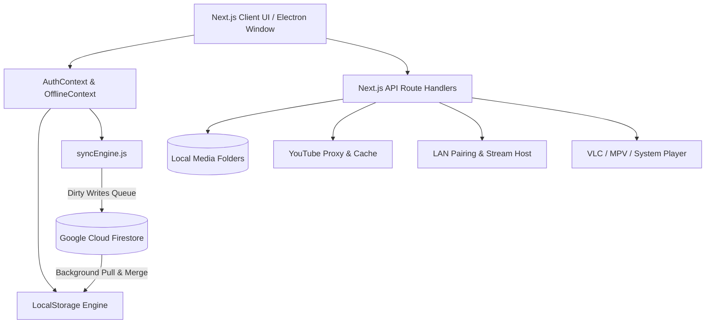

# WatchAnime — Project Structure Documentation

This document details the file architecture, component hierarchy, API routing, and state management systems of the **WatchAnime** application (a desktop-ready Next.js 14 & Electron offline-first anime library tracker and streaming player).

---

## 1. Project Directory Tree

```
watchanime/
├── .env.local                                # Environment variables (Firebase public credentials)
├── .gitignore                                 # Git ignore patterns
├── logo.png                                   # Application branding logo
├── main.js                                    # Electron main process (desktop window, IPC, lifecycle)
├── next.config.mjs                            # Next.js configuration (standalone output, images)
├── package.json                               # Dependencies, build scripts & Electron configuration
├── postcss.config.js                          # PostCSS configuration for Tailwind CSS
├── tailwind.config.js                         # Tailwind CSS styling and theme configuration
├── structure.md                               # Project structure documentation
├── firestore.db                               # Firestore database structure and schema definition
│
├── public/                                    # Static assets served directly by Next.js
│   └── logo.png                               # Public branding logo
│
└── app/                                       # Next.js 14 App Router directory
    ├── [slug]/                                # Root slug route (alias to Anime Detail)
    │   └── page.js                            # Page wrapper for AnimeDetail component
    ├── anime/                                 # Dedicated anime namespace
    │   └── [slug]/
    │       └── page.js                        # Anime detail page router
    ├── notes/                                 # Watcher notebook & markdown scratchpad
    │   ├── page.js                            # Notes dashboard / catalog view
    │   └── [id]/
    │       └── page.js                        # Individual note editor view
    ├── player/                                # Fullscreen web player routes
    │   └── [playerType]/                      # 'artplayer' | 'videojs' | 'youtube'
    │       └── [slug]/
    │           └── page.js                    # Web player route handler
    ├── stream/                                # LAN Sync & Mobile streaming client view
    │   └── page.js                            # Stream connector UI for paired mobile devices
    │
    ├── context/                               # React Context providers (Global State)
    │   ├── AuthContext.js                     # User authentication, Firebase auth state, VLC/player settings
    │   └── OfflineContext.js                  # Network status detector & automatic sync trigger
    │
    ├── lib/                                   # Shared server/client libraries
    │   └── youtubeCacheManager.js             # YouTube video metadata & audio/video stream disk caching
    │
    ├── pages/                                 # Modular page views and player containers
    │   ├── AnimeDetail.js                     # Anime detail screen: episodes, progress, notes, flagger
    │   ├── ArtPlayerContainer.js              # Modern HTML5 ArtPlayer integration with custom controls
    │   ├── Dashboard.js                       # Main dashboard: library grid, carousel, scanner, search/filter
    │   ├── FirebaseSetup.js                   # Interactive client-side Firebase configuration modal
    │   ├── Login.js                           # User login & authentication modal
    │   ├── Player.js                          # Unified player router / selector wrapper
    │   ├── Stream.js                          # Local network streaming server management component
    │   ├── VideoJsContainer.js                # Video.js player integration
    │   └── YoutubePlayerContainer.js          # In-app YouTube player container
    │
    ├── utils/                                 # Core application utilities and engines
    │   ├── localStore.js                      # LocalStorage abstraction layer (Offline-first data persistence)
    │   ├── parser.js                          # Smart episode filename parsing, regex pattern matcher & sorter
    │   └── syncEngine.js                      # Bidirectional offline-to-cloud Firestore sync engine
    │
    ├── api/                                   # Next.js Backend API Route Handlers
    │   ├── close-vlc/
    │   │   └── route.js                       # Closes active external VLC process
    │   ├── image/
    │   │   └── route.js                       # Streams local thumbnail images with MIME-type headers
    │   ├── image-base64/
    │   │   └── route.js                       # Converts local image files to base64 data URIs
    │   ├── manage-folder/
    │   │   └── route.js                       # Opens native OS explorer or performs directory management
    │   ├── play/
    │   │   └── route.js                       # Launches external desktop players (VLC, MPV, MPC-HC)
    │   ├── scan/
    │   │   └── route.js                       # Scans directory recursively for video files and covers
    │   ├── select-folder/
    │   │   └── route.js                       # Native OS folder selection dialog (PowerShell/Electron)
    │   ├── select-image/
    │   │   └── route.js                       # Native OS image/cover selection dialog
    │   ├── vlc-status/
    │   │   └── route.js                       # Checks if VLC media player is installed and reachable
    │   ├── stream/                            # Local Area Network (LAN) Streaming & Pairing
    │   │   ├── store.js                       # In-memory session store for host & paired mobile devices
    │   │   ├── host/
    │   │   │   └── route.js                   # Start/stop LAN streaming host server session
    │   │   ├── library/
    │   │   │   └── route.js                   # Exports tracked library to paired client devices
    │   │   ├── network/
    │   │   │   └── route.js                   # Detects host local network IPv4 address
    │   │   ├── pair/
    │   │   │   └── route.js                   # Authenticates client pairing code & generates pairing token
    │   │   └── ping/
    │   │       └── route.js                   # Heartbeat check for host streaming server
    │   ├── video/                             # Local Video Streaming Subsystem
    │   │   ├── keyframe/
    │   │   │   └── route.js                   # Extracts video timeline keyframe preview thumbnails
    │   │   ├── metadata/
    │   │   │   └── route.js                   # Reads video codecs, dimensions, and duration (ffprobe)
    │   │   ├── stream/
    │   │   │   └── route.js                   # HTTP 206 Partial Content video stream range server
    │   │   └── subtitles/
    │   │       └── route.js                   # Extracts and serves embedded or sidecar subtitles (.vtt/.ass)
    │   └── youtube/                           # YouTube Streaming & Playlist Proxy
    │       ├── close-stream/
    │       │   └── route.js                   # Terminates active yt-dlp background streaming process
    │       ├── duration/
    │       │   └── route.js                   # Fetches YouTube video duration
    │       ├── playlist/
    │       │   └── route.js                   # Parses and extracts YouTube playlist video metadata
    │       ├── qualities/
    │       │   └── route.js                   # Lists available stream video/audio resolutions
    │       └── stream/
    │           └── route.js                   # Proxies YouTube live video stream to HTML5 video element
    │
    ├── firebase.js                            # Firebase Client SDK initializer (Auth, Firestore)
    ├── globals.css                            # Global styles, Tailwind base directives, custom scrollbars
    ├── icon.png                               # Next.js application icon
    ├── layout.js                              # Root layout wrapping context providers and styling
    └── page.js                                # Main application root entry page
```

---

## 2. Technology Stack & Core Dependencies

| Category | Technology | Purpose |
| :--- | :--- | :--- |
| **Framework** | Next.js 14 (App Router) | Fullstack React framework for UI components and server API routes |
| **Desktop Wrapper** | Electron 42 | Desktop window management, local system dialogs, and native app bundling |
| **Database & Cloud** | Google Cloud Firestore (Firebase v10) | Cloud sync, cross-device multi-user state synchronization |
| **Local Persistence**| LocalStorage & In-memory Queue | Instant offline access and offline mutation queueing |
| **Styling** | Tailwind CSS + Lucide React | Modern dark-mode UI, reactive layouts, glassmorphism, and icon set |
| **Animations** | Framer Motion | Smooth page transitions, modals, hero carousels, and micro-interactions |
| **Video Players** | ArtPlayer & Video.js | Customizable web-based media players for in-browser playback |
| **External Media** | VLC / MPV / MPC-HC CLI | Native external playback with progress tracking |
| **YouTube Pipeline** | `yt-dlp` / `ytdl-core` | YouTube playlist extraction and video streaming proxy |

---

## 3. Architecture & Data Flow



### Key Subsystems:
1. **Offline-First Data Storage (`localStore.js` & `syncEngine.js`)**:
   - All mutations (adding anime, progress updates, marking episodes, notes) write synchronously to `localStorage`.
   - When offline or online, ops are enqueued into `watchanime_dirty_queue`.
   - `syncEngine.js` pushes batches up to 490 documents per transaction to Firestore and pulls remote changes seamlessly.

2. **Native Local File Scanning & Streaming (`app/api/`)**:
   - `scan/route.js` navigates local anime directories, recognizing season structures, specials, movies, and cover images.
   - `parser.js` extracts episode numbers from standard, bracketed, or complex fansub release formats.
   - `video/stream/route.js` serves local MP4/MKV video files with `HTTP 206 Partial Content` range headers for smooth scrubbing.

3. **Multi-Player Ecosystem (`app/pages/`)**:
   - **Internal Players**: Choose between **ArtPlayer** and **Video.js** with full support for shortcuts, speed control, subtitles, and resume points.
   - **External Players**: Direct bridge to launch **VLC** or other desktop media players with automated process monitoring.
   - **YouTube Integration**: Direct playlist importing and in-app streaming with custom resolution selection.

4. **LAN Mobile Streaming & Pairing (`app/api/stream/`)**:
   - Allows hosting the anime library on the local network.
   - Mobile devices can scan a QR code or enter a 10-character pairing passcode to stream desktop anime files on phone or tablet browsers.
